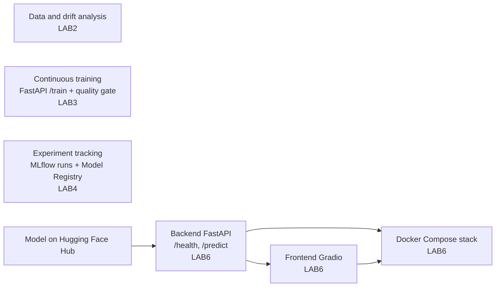

# MLOps coursework: from data drift to a containerised model service

Academic exercises for the MLOps course in the Máster Universitario en Inteligencia Artificial at Universidad Loyola Andalucía (2025–2026): data-drift detection, continuous training behind a quality gate, experiment tracking and model registry with MLflow, and deployment of a FastAPI + Gradio stack with Docker Compose.

   

**Resumen (ES).** Ejercicios académicos de la asignatura MLOps del Máster Universitario en Inteligencia Artificial de la Universidad Loyola Andalucía (2025–2026): detección de *data drift* con validación adversaria, reentrenamiento continuo con una API FastAPI y una puerta de calidad, seguimiento de experimentos y registro de modelos con MLflow, y despliegue de un backend FastAPI y un frontend Gradio con Docker Compose. Cada práctica está en su propia rama.

> **Where is the code?** Each lab lives on its own branch (and, for labs 3, 4 and 6, a tag). `main` only holds this overview.

---

## What it covers

| Lab | Branch / tag | Topic | Main tools |
|---|---|---|---|
| 1 | [`LAB1`](../../tree/LAB1) | MLOps analysis presentation (group work) | — |
| 2 | [`LAB2`](../../tree/LAB2) | Product-failure prediction and **data drift** detection with adversarial validation | pandas, scikit-learn (Gradient Boosting, StratifiedKFold, AUC-ROC) |
| 3 | [`lab3`](../../tree/lab3) · tag `v3` | **Continuous training** service: retraining endpoint with a quality gate and configurable activation policies (`any_improvement`, `min_delta`, `per_class_f1`), model versioning and training history | FastAPI, scikit-learn, joblib, Docker |
| 4 | [`lab4`](../../tree/lab4) · tag `v4` | **Experiment tracking and model registry**: grid search over three model families, selection with a recall-first medical criterion, model served through the MLflow API and evaluated on a held-out test set | MLflow, scikit-learn |
| 6 | [`lab6`](../../tree/lab6) · tag `v6` | **Deployment**: FastAPI backend that downloads the model from Hugging Face Hub, Gradio frontend, Docker health check and ordered start-up with Docker Compose, end-to-end check script | FastAPI, Gradio, Docker Compose, Hugging Face Hub |

No LAB5 branch or source files are included. LAB6 downloads an existing model from Hugging Face Hub; publishing that model is outside the material available here.

## Topics across the exercises

The labs cover different stages of the model lifecycle. The diagram groups the topics; these are independent exercises using different datasets, not one executable pipeline.



## How to run it

Check out the branch of the lab you want first, for example `git checkout lab6`.

**LAB2: data drift (notebook)**

```bash
git checkout LAB2
pip install -r requirements.txt
jupyter notebook LAB2-DataDrift.ipynb
```

The notebook expects `train.csv` and `test.csv` in the same folder. They are not in the repository (see `.gitignore`), and the notebook does not identify a download source. You need the course data to reproduce this exercise.

**LAB3: continuous training API**

```bash
git checkout lab3
cd LAB3/src
pip install -r requirements.txt
uvicorn main:app --reload            # interactive docs at http://localhost:8000/docs
python demo_ct.py --reset            # in another terminal: runs the full CT flow

# or with Docker
docker build -t iris-ct .
docker run -d -p 8000:80 -v iris-ct-models:/app/models --name iris-ct iris-ct
```

Endpoints: `GET /health`, `POST /predict`, `POST /train`, `GET /model/info`, `DELETE /model/history`. Full details in `LAB3/src/README.md`.

**LAB4: MLflow experiments**

```bash
git checkout lab4
pip install mlflow scikit-learn pandas requests
python LAB4/experimento_prueba.py
python LAB4/experimentos_completos.py
mlflow models serve -m "models:/diabetes-best/1" --port 5001 --env-manager=local
python LAB4/evaluar_api.py --port 5001
```

Uses the PIMA Indians Diabetes dataset (`LAB4/diabetes.csv`). Report: `LAB4/informe.md`.

**LAB6: Docker Compose stack**

```bash
git checkout lab6
cd LAB6
cp .env.example .env                 # set HF_TOKEN if needed; never commit .env
docker compose up --build
./verify_stack.sh                    # prints STACK OK when /health and a prediction succeed
```

Backend on <http://localhost:8000>, Gradio frontend on <http://localhost:7860>.

**Requirements:** Python 3.11 (the Docker images use `python:3.11-slim`) and Docker with Compose for labs 3 and 6. LAB6 needs network access to download the Hugging Face model; authentication depends on that model's access settings. The backend accepts `HF_TOKEN` from the environment, and `.env.example` contains a placeholder only.

## Reports and verification

LAB2, LAB3, LAB4 and LAB6 include PDF reports; LAB1 contains a group presentation, and LAB4 also includes `informe.md`. LAB4's API test-set metrics remain pending in section 5 of that report. LAB6 includes `verify_stack.sh` to check backend health and a prediction, plus an optional frontend availability check. A successful run must be verified in your own environment; this overview does not report a new execution or measured deployment result.

## Limitations

- Teaching datasets (Iris, PIMA Diabetes and the LAB2 product-failure data), not production data.
- In LAB4, validation metrics were computed after retraining on train + validation, so they are optimistic; the report itself points this out and relies on the test set via the API.
- Labs are independent exercises on separate branches, not a single integrated pipeline.

## Context

MLOps course, Máster Universitario en Inteligencia Artificial, Universidad Loyola Andalucía (2025–2026). Author: Ignacio González Peris. LAB1 was a group presentation.
